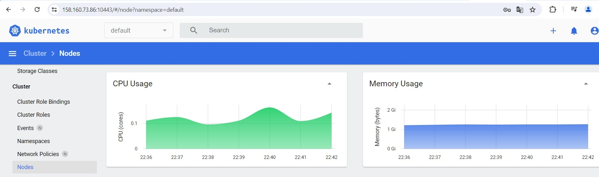

# Домашнее задание к занятию «Kubernetes. Причины появления. Команда kubectl» - Балдин

### Задание 1. Установка MicroK8S

1. Установить MicroK8S на локальную машину или на удалённую виртуальную машину.

```bash
root@kube-baldin-test:/home/baldin1987# microk8s status --wait-ready
microk8s is running
high-availability: no
  datastore master nodes: 127.0.0.1:19001
  datastore standby nodes: none
addons:
  enabled:
    dns                  # (core) CoreDNS
    ha-cluster           # (core) Configure high availability on the current node
    helm                 # (core) Helm - the package manager for Kubernetes
    helm3                # (core) Helm 3 - the package manager for Kubernetes
  disabled:
    cert-manager         # (core) Cloud native certificate management
    cis-hardening        # (core) Apply CIS K8s hardening
    community            # (core) The community addons repository
    dashboard            # (core) The Kubernetes dashboard
    gpu                  # (core) Alias to nvidia add-on
    host-access          # (core) Allow Pods connecting to Host services smoothly
    hostpath-storage     # (core) Storage class; allocates storage from host directory
    ingress              # (core) Ingress controller for external access
    kube-ovn             # (core) An advanced network fabric for Kubernetes
    mayastor             # (core) OpenEBS MayaStor
    metallb              # (core) Loadbalancer for your Kubernetes cluster
    metrics-server       # (core) K8s Metrics Server for API access to service metrics
    minio                # (core) MinIO object storage
    nvidia               # (core) NVIDIA hardware (GPU and network) support
    observability        # (core) A lightweight observability stack for logs, traces and metrics
    prometheus           # (core) Prometheus operator for monitoring and logging
    rbac                 # (core) Role-Based Access Control for authorisation
    registry             # (core) Private image registry exposed on localhost:32000
    rook-ceph            # (core) Distributed Ceph storage using Rook
    storage              # (core) Alias to hostpath-storage add-on, deprecated
```
   
2. Установить dashboard.

```bash
root@kube-baldin-test:~# microk8s enable dashboard
```

3. Сгенерировать сертификат для подключения к внешнему ip-адресу.

Добавил в /var/snap/microk8s/current/certs/csr.conf.template публичный IP и обновил сертификат:

```bash
root@kube-baldin-test:/home/baldin1987# sudo nano /var/snap/microk8s/current/certs/csr.conf.template
-proxy-client.crttest:/home/baldin1987# sudo microk8s refresh-certs --cert front
Taking a backup of the current certificates under /var/snap/microk8s/6809/certs-backup/
Creating new certificates
Signature ok
subject=CN = front-proxy-client
Getting CA Private Key
Restarting service kubelite.
```

------

### Задание 2. Установка и настройка локального kubectl
1. Установить на локальную машину kubectl.

```bash
root@kube-baldin-test-2:~# kubectl version --client
Client Version: v1.30.1
Kustomize Version: v5.0.4-0.20230601165947-6ce0bf390ce3
```

2. Настроить локально подключение к кластеру.

Забираю в конфиге `cluster`, `user` и `context` на локальную машину, после чего переключаюсь на другой контекст.

```bash
root@kube-baldin-test-2:~# kubectl config use-context remote-context
Switched to context "remote-context".
root@kube-baldin-test-2:~# kubectl get nodes
NAME               STATUS   ROLES    AGE    VERSION
kube-baldin-test   Ready    <none>   161m   v1.29.4
```

3. Подключиться к дашборду с помощью port-forward.



------

### Правила приёма работы

1. Домашняя работа оформляется в своём Git-репозитории в файле README.md. Выполненное домашнее задание пришлите ссылкой на .md-файл в вашем репозитории.
2. Файл README.md должен содержать скриншоты вывода команд `kubectl get nodes` и скриншот дашборда.

------

### Критерии оценки
Зачёт — выполнены все задания, ответы даны в развернутой форме, приложены соответствующие скриншоты и файлы проекта, в выполненных заданиях нет противоречий и нарушения логики.

На доработку — задание выполнено частично или не выполнено, в логике выполнения заданий есть противоречия, существенные недостатки.
